# Smart Daily Expense Tracker 📒

## Download the APK

Get the latest APK for **Smart Daily Expense Tracker**:

[](https://github.com/yesshreyes/daily-expense-tracker/releases/download/v0.1.0/app.apk)

---

## App Overview

**Smart Daily Expense Tracker** is a native Android module built with **Kotlin + Jetpack Compose** following a clean **MVVM** pattern.  
This module helps small business owners digitize daily expenses that are often lost on paper or WhatsApp — making cash-flow tracking simple, fast, and intelligent.

Core ideas:
- Fast expense capture (title, amount, category, optional notes, receipt image).
- Real-time daily totals and quick filtering.
- Short-term analytics (7-day mock reports) and easy export (PDF/CSV simulation).

---

## 🤖 AI Usage Summary

I used ChatGPT extensively throughout the development of the Smart Daily Expense Tracker:  

- **UI & Frontend:** I started by generating Jetpack Compose screen layouts (Entry, List, Report) with ChatGPT’s help. It accelerated building the base UI by suggesting components, validation, and animations.  
- **Feature Implementation:** I provided the app’s required features as input and implemented them step by step with ChatGPT guiding validation logic, state handling, and data flow patterns.  
- **Architecture & Code Quality:** After achieving a working app, I used ChatGPT to refine the architecture, making the code more modular and scalable. This included improving the MVVM structure, breaking down responsibilities, and reorganizing the file structure.  
- **Overall Workflow:** ChatGPT acted as a coding partner, helping me brainstorm solutions, improve UX, and ensure best practices while speeding up implementation.  


---

## 📝 Prompt Logs (Key Prompts)

First I just gave the context of the application to ChatGPT. Later asked for specific outputs.

```
lets start with first screen 
kotlin jetpack compose latest code
Expense Entry Screen Input fields: Title (text) Amount (₹) Category (mocked list: Staff, Travel, Food, Utility) Optional Notes (max 100 chars) Optional Receipt Image (upload or mock) Submit Button: Adds expense, shows Toast, animates entry Show real-time “Total Spent Today” at top
This will be the design structure:
- TopBar color 
#476EE4, logo, text = Zobase, Font name
"Source Sans Pro", sans-serif, and in the edge a hamburger icon 
- Text total spent: rupees symbol and a dummy value
- Outlined Textfield - "Add items" 
- circular iconbutton on the right side of text field with a icon of cart
- rupees symbol and text field with 0 written where i will add amount to pay, keyboard option numbers
- Small add note textfield in greyish color with note written there
- submit button and a camera square icon button on right of the button
Primary color make it white and secondary  476EE4
Give a modern look. Use glassmorphism. Shadows. 
```

```
i want a new screen 2. Expense List Screen View expenses for: Today (default) Previous dates via calendar or filter Group by category or time (toggle) Show: Total count, total amount, empty state Now what i want here is: - After topbar I want the todays date dd Month (then year in next line) to be displayed and then in the rightmost side calendar iconbutton, opens calendar - In scrollable column display transactions ex- ItemsName (category tag) and then money on rightmost side show +/- and change color according to credit and debit(green red) - i want a search bar above which will filter with respect the category - Total of ___(no. of transaction)____ transaction and then in a outlined box [ Rs. ]
```

```
Perfect
now similarly i want one more page ExpenseReportScreen same theme and colors design shadows
3. Expense Report Screen
Mock report for last 7 days:
Daily totals
Category-wise totals
Bar or line chart (mocked)
Export (optional):
Simulate PDF/CSV export
Trigger Share intent (optional)

Here:
-Same top bar will bee present
-Transaction graph text
-bar graph for transaction
-under that subheading "Category"
- under that in 2 columns and multiple rows, category name and total expenditure in it
- a button "Export" 
```

---

## ✅ Feature Checklist

### Primary Screens & Flows
- **Expense Entry Screen**
  - [x] Title (text)
  - [x] Amount (₹) — validated (> 0)
  - [x] Category (mock list: Staff, Travel, Food, Utility)
  - [x] Optional Notes (max 100 chars)
  - [x] Optional Receipt Image (upload or mocked)
  - [x] Submit Button: adds expense, shows Toast, entry animation
  - [x] Real-time **Total Spent Today** displayed at top

- **Expense List Screen**
  - [x] View expenses for Today (default)
  - [ ] Navigate previous dates via calendar or filter
  - [ ] Toggle grouping: by Category or by Time
  - [x] Show total count, total amount

- **Expense Report Screen**
  - [x] Mock report for last 7 days
  - [ ] Daily totals
  - [x] Category-wise totals
  - [x] Bar or line chart (mocked)
  - [x] Export simulation (PDF/CSV)
  - [x] Trigger Share intent (optional)

### State & Data
- [x] ViewModel + StateFlow (or LiveData) per screen
- [x] In-memory repository (default) / optional Room persistence
- [x] Navigation (Jetpack Navigation Compose)

### Bonus / Nice-to-have
- [ ] Theme switcher (Light / Dark)
- [x] Persist data locally (Room / DataStore)
- [x] Add animation on add (entry animation)
- [ ] Duplicate detection (basic heuristic)
- [x] Validation (amount > 0, title non-empty)
- [ ] Offline-first sync (mock)
- [x] Reusable UI components 

---

## 📱 Screenshots & Recordings

Here are some previews from the Smart Daily Expense Tracker app:

| Splash Screen | Entry Screen | List Screen|
| :-----------: | :---: | :--: |
| 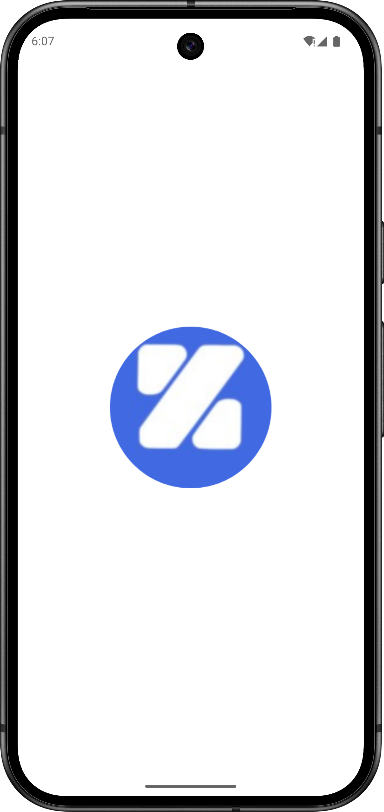 | 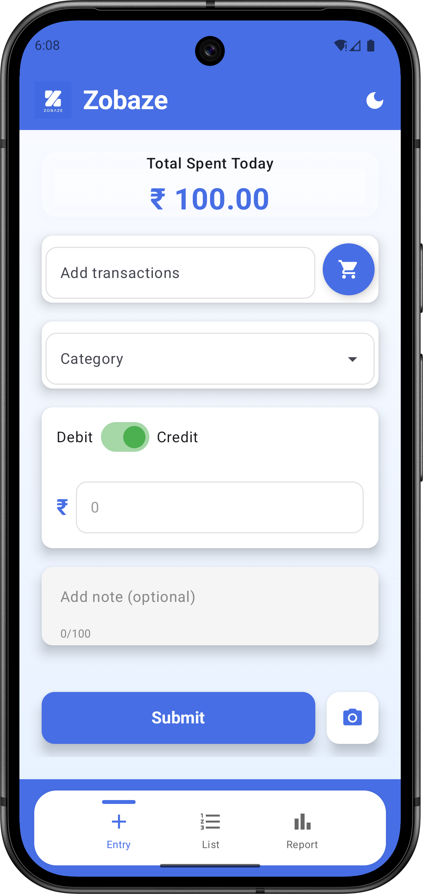 | 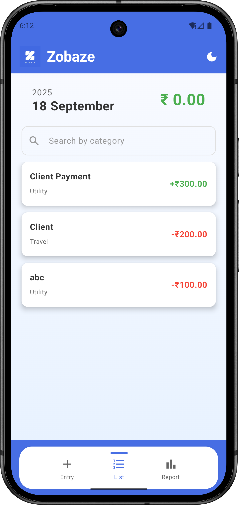 |

| Calendar View | Daily Graph | Category Graph |
| :-----------: | :---------: | :------------: |
| 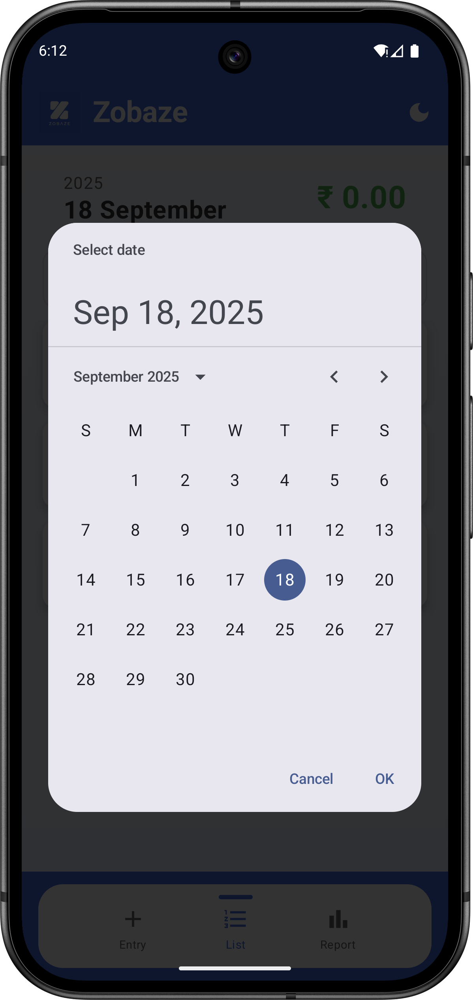 | 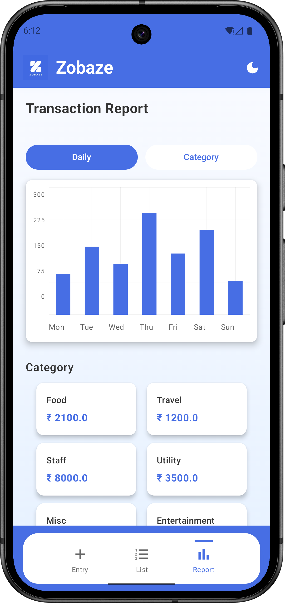 | 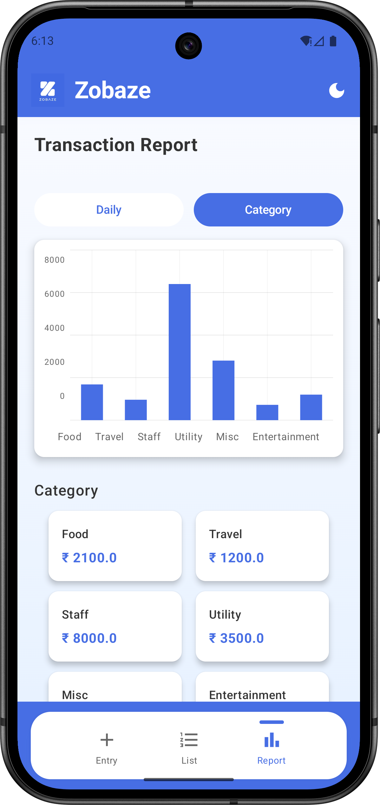 |

| Search | Amount Keyboard | Empty Field Validation |
| :----: | :------: | :-------------------: |
| 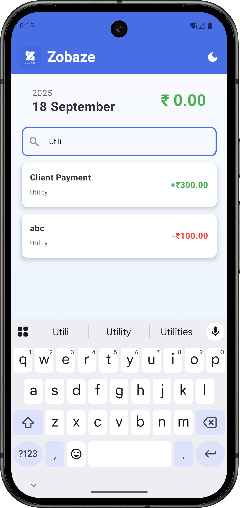 | 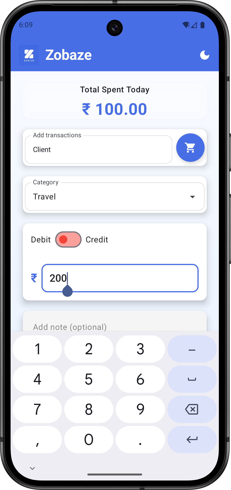 |  |

| Export | Image Upload | Entry Recording |
| :----: | :----------: | :-------------: |
| 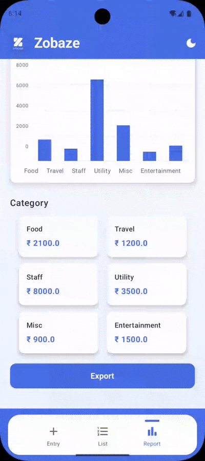</img> | 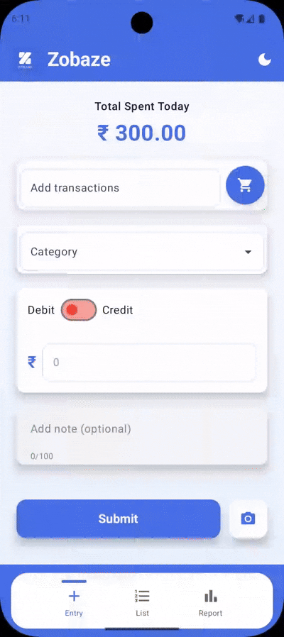</img> | 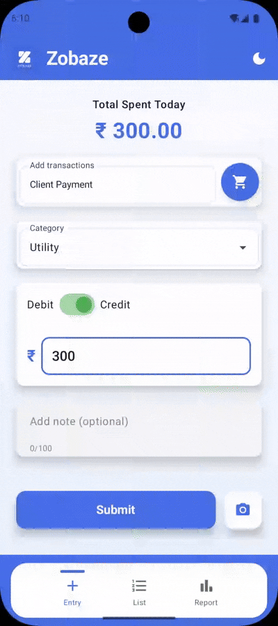</img> |

---
